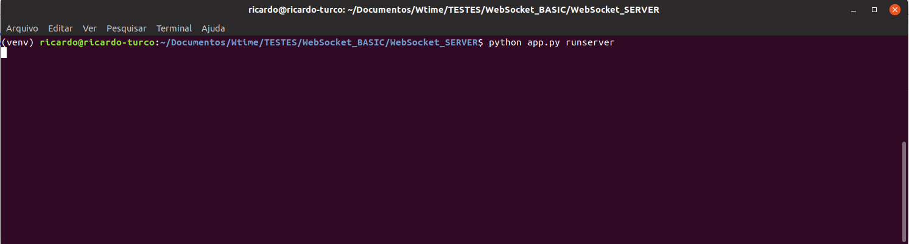
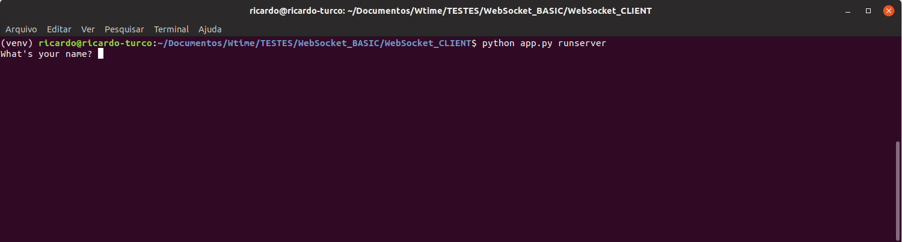
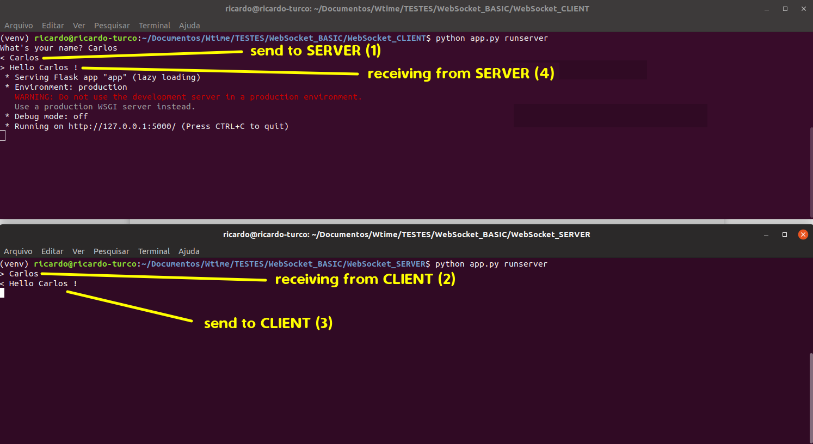

# WebSocket_BASIC
Basic example of WebSocket using Flask and Python 3.4

ATTENTION:  you must install Python 3.4 in your enviroment !!!

Open 2 "terminals" on your computer. In each one go to "WebSocket_SERVER" and "WebSocket_CLIENT" respectively.

Execute these instructions on each one:

Create virtualenv using Python 3.4;
(virtualenv -p python3.4 venv)

Active the virtualenv;

pip install -r requirements.txt;

RUNNING THE "HELLO" METHOD: 

In the "WebSocket_SERVER" terminal, when it is executed "python app.py runserver", the terminal will wait:

In the "WebSocket_CLIENT" terminal, when it is executed "python app.py runserver", the terminal will look like this:

When you enter a person's name, the "CLIENT" sends it to the "SERVER", where it will return the message: 

"... Hello NAME ! ..."

